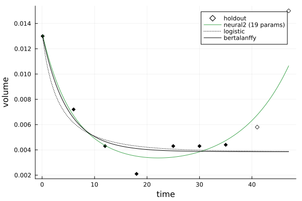

# TumorGrowth.jl

Predictive models for tumor growth, and tools to apply them to clinical data

[](https://github.com/bcgov/repomountie/blob/master/doc/lifecycle-badges.md) 
[](https://github.com/ablaom/TumorGrowth.jl/actions)
[](https://codecov.io/github/ablaom/TumorGrowth.jl?branch=master)
[](https://ablaom.github.io/TumorGrowth.jl/dev/)

Please refer to the [documentation](https://ablaom.github.io/TumorGrowth.jl/dev) for an
overview of this package.


## Code snippet

```julia
using TumorGrowth, Lux, Random

times = [0.1, 6.0, 12.0, 18.0, 25.0, 30.0, 35.0, 41.0, 47.0]
volumes = [0.013, 0.0072, 0.0043, 0.0021, 0.0043, 0.0043, 0.0044, 0.0058, 0.015]

# define an experimental model based on a neural ODE:
network = Lux.Chain(Dense(2, 3, Lux.tanh; init_weight=Lux.zeros64), Dense(3, 2))
neural_model = neural2(Random.default_rng(), network)

# compare with with some classical models:
models = [neural_model, logistic, bertalanffy]

julia> comparison = compare(times, volumes, models, holdouts=2)
ModelComparison with 2 holdouts:
  metric: mae
  neural2 (19 params):  0.002656
  logistic:     0.00651
  bertalanffy:  0.006542

using Plots

julia> plot(comparison)
```




## Acknowledgements

The datasets provided the TumorGrowth.jl software are sourced from Laleh et
al. [(2022)](https://doi.org/10.1371/journal.pcbi.1009822) "Classical mathematical models
for prediction of response to chemotherapy and immunotherapy", *PLOS Computational
Biology*", with some restructuring provided by Yasin Elmaci and Okon Samuel.


## Citing this work

[](https://arxiv.org/abs/2502.07964)

```bibtex
@misc{blaom2025newtoolscomparingclassical,
      title={New tools for comparing classical and neural ODE models for tumor growth}, 
      author={Anthony D. Blaom and Samuel Okon},
      year={2025},
      eprint={2502.07964},
      archivePrefix={arXiv},
      primaryClass={cs.LG},
      url={https://arxiv.org/abs/2502.07964}, 
}
```

