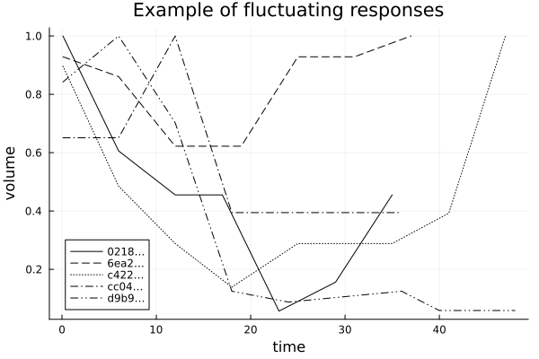

```@meta
EditURL = "notebook.jl"
```

````@julia
using Pkg

dir = @__DIR__
Pkg.activate(dir)
Pkg.instantiate()

using TumorGrowth
using Plots
linestyles = [:solid :dash :dot :dashdot :dashdotdot]
````

````
1×5 Matrix{Symbol}:
 :solid  :dash  :dot  :dashdot  :dashdotdot
````

# DATA INGESTION

Load the Laleh et al (2022) data set as a row table (vector of named tuples):

````@julia
records = patient_data();
````

Inspect the field names:

````@julia
keys(first(records))
````

````
(:Pt_hashID, :Study_Arm, :Study_id, :Arm_id, :T_weeks, :T_days, :Lesion_diam, :Lesion_vol, :Lesion_normvol, :response, :readings)
````

Get the records which have a least 6 measurements and have "fluctuating" type:

````@julia
records6 = filter(records) do record
    record.readings >= 6 && record.response == "flux"
end;
````

Plot some of these records:

````@julia
plt = plot(xlab="time", ylab="volume (rescaled by maximum)")
for (i, record) in enumerate(records6[1:5])
    times = record.T_weeks
    volumes = record.Lesion_normvol
    id = string(record.Pt_hashID[1:4], "…")
    max = maximum(volumes)
    plot!(times, volumes/max, label=id, linestyle=linestyles[i], linecolor=:black)
end
plot!(xlab="time", ylab="volume", title = "Example of fluctuating responses")
gui()
````



````@julia
savefig(joinpath(dir, "fluctuating_patient_data.png"))
````

````
"/Users/anthony/GoogleDrive/Julia/TumorGrowth/docs/src/examples/01_data_visualization/fluctuating_patient_data.png"
````

---

*This page was generated using [Literate.jl](https://github.com/fredrikekre/Literate.jl).*

