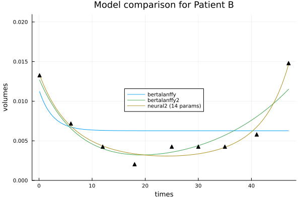
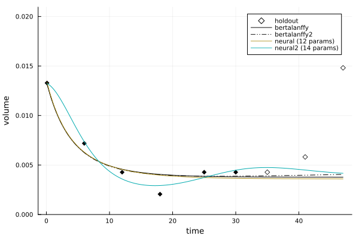

```@meta
EditURL = "notebook.jl"
```

# Calibration workflows

The code below is also available in
[notebook](https://github.com/ablaom/TumorGrowth.jl/tree/dev/docs/src/examples/03_calibration/)
form.

````@julia
dir = @__DIR__

using TumorGrowth
using Statistics
using Plots
using IterationControl

Plots.scalefontsizes() # reset font sizes
Plots.scalefontsizes(0.85)
````

````
  Activating project at `~/GoogleDrive/Julia/TumorGrowth/docs/src/examples/03_calibration`

````

## Data ingestion

Get the records which have a least 6 measurements:

````@julia
records = patient_data();
records6 = filter(records) do record
    record.readings >= 6
end;
````

## Helpers

Wrapper to only apply control every 100 steps:

````@julia
sometimes(control) = IterationControl.skip(control, predicate=100)
````

````
sometimes (generic function with 1 method)
````

Wrapper to only apply control after first 30 steps:

````@julia
warmup(control) = IterationControl.Warmup(control, 30)
````

````
warmup (generic function with 1 method)
````

## Patient A - a volume that is mostly decreasiing

````@julia
record = records6[2]
````

````
(Pt_hashID = "19ce84cc1b10000b63820280995107c2-S1", Study_Arm = InlineStrings.String15("Study_1_Arm_1"), Study_id = 1, Arm_id = 1, T_weeks = [0.1, 6.0, 16.0, 24.0, 32.0, 39.0], T_days = [-12, 38, 106, 166, 222, 270], Lesion_diam = [14.0, 10.0, 9.0, 8.0, 8.0, 8.0], Lesion_vol = [1426.88, 520.0, 379.08, 266.24, 266.24, 266.24], Lesion_normvol = [0.000231515230057292, 8.4371439525252e-5, 6.15067794139087e-5, 4.3198177036929e-5, 4.3198177036929e-5, 4.3198177036929e-5], response = InlineStrings.String7("down"), readings = 6)
````

````@julia
times = record.T_weeks
volumes = record.Lesion_normvol;
````

We'll try calibrating the generalized Bertalanffy model, `bertalanffy`, with fixed
parameter `λ=1/5`:

````@julia
problem = CalibrationProblem(
    times,
    volumes,
    bertalanffy;
    frozen=(; λ=1/5),
    learning_rate=0.001,
    half_life=21, # place greater weight on recent measurements
)
````

````
CalibrationProblem: 
  model: bertalanffy
  current solution: v0=0.000232  v∞=4.32e-5  ω=0.0432  λ=0.2
````

The controls in the `solve!` call below have the following interpretations:

- `Step(1)`: compute 1 iteration at a time
- `InvalidValue()`: to catch parameters going out of bounds
- `NumberLimit(6000)`: stop after 6000 steps
- `GL() |> warmup`:  stop using Prechelt's GL criterion after the warm-up period
- `NumberSinceBest(10) |> warmup`:  stop when it's 10 steps since the best so far
- `Callback(prob-> (plot(prob); gui())) |> sometimes`: periodically plot the problem

Some other possible controls are:

- `TimeLimit(1/60)`: stop after 1 minute
- `WithLossDo()`: log to `Info` the current loss

See
[IterationControl.jl](https://github.com/JuliaAI/IterationControl.jl?tab=readme-ov-file#controls-provided)
for a complete list.

````@julia
solve!(
    problem,
    Step(1),
    InvalidValue(),
    NumberLimit(6000),
    GL() |> warmup,
    NumberSinceBest(10)  |> warmup,
    Callback(prob-> (plot(prob); gui())) |> sometimes,
)
gui()
````

````
[ Info: final loss: 5.190581338811233e-10
[ Info: Stop triggered by NumberLimit(6000) stopping criterion. 

````

````@julia
p = solution(problem)
extended_times = vcat(times, [40.0, 47.0])
bertalanffy(extended_times, p)
````

````
8-element Vector{Float64}:
 0.00022152247503693192
 0.0001180049861840984
 5.990483693858979e-5
 4.433878258915783e-5
 3.731322416306445e-5
 3.4181697237280434e-5
 3.386717191488983e-5
 3.225813777978713e-5
````

````@julia
plot(problem, title="Patient A, λ=1/5 fixed", color=:black)
gui()
````


````@julia
savefig(joinpath(dir, "patientA.png"))
````

````
"/Users/anthony/GoogleDrive/Julia/TumorGrowth/docs/src/examples/03_calibration/patientA.png"
````

## Patient B - relapse following initial improvement

````@julia
record = records6[10]

times = record.T_weeks
volumes = record.Lesion_normvol;
````

We'll first try the earlier simple model, but we won't freeze `λ`. Also, we won't
specify a `half_life`, giving all the data equal weight.

````@julia
problem = CalibrationProblem(
    times,
    volumes,
    bertalanffy;
    learning_rate=0.001,
)

solve!(
    problem,
    Step(1),
    InvalidValue(),
    NumberLimit(6000),
)
plot(problem, label="bertalanffy")
gui()
````

````
[ Info: final loss: 0.00010518082495583373
[ Info: Stop triggered by NumberLimit(6000) stopping criterion. 

````

Let's try the 2D generalization of the generalized Bertalanffy model:

````@julia
problem = CalibrationProblem(
    times,
    volumes,
    bertalanffy2;
    learning_rate=0.001,
)

solve!(
    problem,
    Step(1),
    InvalidValue(),
    NumberLimit(6000),
)
plot!(problem, label="bertalanffy2")
gui()
````

(Plot appears below.)

````
[ Info: final loss: 0.0001486220557414735
[ Info: Stop triggered by NumberLimit(1000) stopping criterion. 
[ Info: final loss: 0.0001486220557414735
[ Info: Stop triggered by NumberLimit(1000) stopping criterion. 
[ Info: final loss: 1.0981748197354352e-5
[ Info: Stop triggered by NumberLimit(6000) stopping criterion. 

````

Here's how we can inspect the final parameters:

````@julia
solution(problem)
````

````
(v0 = 0.013418165323626751, v∞ = 0.0003759183541925138, ω = 0.12123897563008784, λ = 1.0752692228665386, γ = 0.7251887879657256)
````

Or we can do:

````@julia
solution(problem) |> pretty
````

````
"v0=0.0134  v∞=0.000376  ω=0.121  λ=1.08  γ=0.725"
````

And finally, we'll try a 2D neural ODE model, with fixed volume scale `v∞`.

````@julia
using Lux, Random
````

*Note well* the zero-initialization of weights in first layer:

````@julia
network2 = Chain(
    Dense(2, 2, Lux.tanh, init_weight=Lux.zeros64),
    Dense(2, 2),
)
````

````
Chain(
    layer_1 = Dense(2 => 2, tanh_fast),  # 6 parameters
    layer_2 = Dense(2 => 2),            # 6 parameters
)         # Total: 12 parameters,
          #        plus 0 states.
````

Notice this network has a total of 12 parameters. To that we'll be adding the initial
value `u0` of the latent variable. So this is a model with relatively high complexity
for this problem.

````@julia
n2 = neural2(Xoshiro(123), network2) # `Xoshiro` is a random number generator
````

````
Neural2 model, (times, p) -> volumes, where length(p) = 14
  transform: log
````

Note the reduced learning rate.

````@julia
v∞ = mean(volumes)

problem = CalibrationProblem(
    times,
    volumes,
    n2;
    frozen = (; v∞),
    learning_rate=0.001,
)

solve!(
    problem,
    Step(1),
    InvalidValue(),
    NumberLimit(6000),
)
plot!(
    problem,
    title = "Model comparison for Patient B",
    label = "neural2",
    legend=:inside,
)
gui()
````

````
[ Info: final loss: 4.9467503956431245e-6
[ Info: Stop triggered by NumberLimit(6000) stopping criterion. 

````



````@julia
savefig(joinpath(dir, "patientB.png"))
````

````
"/Users/anthony/GoogleDrive/Julia/TumorGrowth/docs/src/examples/03_calibration/patientB.png"
````

For a more principled comparison, we compare the models on a holdout set. We'll
additionally throw in 1D neural ODE model.

````@julia
network1 = Chain(
    Dense(1, 3, Lux.tanh, init_weight=Lux.zeros64),
    Dense(3, 1),
)

n1 = neural(Xoshiro(123), network1)

models = [bertalanffy, bertalanffy2, n1, n2]
calibration_options = [
    (frozen = (; λ=1/5), learning_rate=0.001, half_life=21), # bertalanffy
    (frozen = (; λ=1/5), learning_rate=0.001, half_life=21), # bertalanffy2
    (frozen = (; v∞), learning_rate=0.001, half_life=21), # neural
    (frozen = (; v∞), learning_rate=0.001, half_life=21), # neural2
]
n_iterations = [6000, 6000, 6000, 6000]
comparison = compare(times, volumes, models; calibration_options, n_iterations)
````

````
ModelComparison with 3 holdouts:
  metric: mae
  bertalanffy: 	0.004676
  bertalanffy2: 	0.002197
  neural (12 params): 	0.004685
  neural2 (14 params): 	0.004147
````

````@julia
plot(comparison)
gui()
````



````@julia
savefig(joinpath(dir, "patientB_validation.png"))
````

````
"/Users/anthony/GoogleDrive/Julia/TumorGrowth/docs/src/examples/03_calibration/patientB_validation.png"
````

---

*This page was generated using [Literate.jl](https://github.com/fredrikekre/Literate.jl).*

