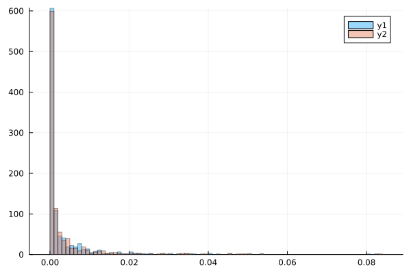

```@meta
EditURL = "notebook.jl"
```

# Model Battle

The analysis below is also available in
[notebook](https://github.com/ablaom/TumorGrowth.jl/tree/dev/docs/src/examples/04_model_battle/)
form.

**Note.** The `@threads` call in this analysis takes about 4 hours to complete on a
2018 MacBook Pro.

We compare the predictive performance of several tumor growth models on data collected
in Laleh et al. [(2022)](https://doi.org/10.1371/journal.pcbi.1009822) "Classical
mathematical models for prediction of response to chemotherapy and immunotherapy", *PLOS
Computational Biology*". In particular, we determine whether differences observed are
statistically significant.

In addition to classical models, we include a 2D generalization of the General
Bertalanffy model, `bertalanffy2`, and some 1D and 2D neural ODE's. The 2D models still
model a single lesion feature, namely it's volume, but add a second latent variable
coupled to the volume, effectively making the model second order. For further details,
refer to the TumorGrowth.jl [package
documentation](https://ablaom.github.io/TumorGrowth.jl/dev/).

## Conclusions

We needed to eliminate about 10% of patient records because of failure of the neural
network models to converge before parameters went out of bounds. A bootstrap comparison
of the differences in mean absolute errors suggest that the General Bertalanffy model
performs significantly better than all other models, with of the exception the 1D neural
ODE. However, in pair-wise comparisons the neural ODE model was *not* significantly
better than any model. Results are summarised in the table below. Arrows point to
bootstrap winners in the top row or first column.

|                            | **logistic** | **classical\_bertalanffy** | **bertalanffy** | **bertalanffy2** | **1D neural** | **2D neural** |
|---------------------------:|-------------:|---------------------------:|----------------:|-----------------:|--------------:|--------------:|
|               **gompertz** |         draw |                       draw |               ↑ |             draw |          draw |             ← |
|               **logistic** |          n/a |                       draw |               ↑ |             draw |          draw |             ← |
| **classical\_bertalanffy** |         draw |                        n/a |               ↑ |             draw |          draw |             ← |
|            **bertalanffy** |            ← |                          ← |             n/a |                ← |          draw |             ← |
|           **bertalanffy2** |         draw |                       draw |               ↑ |              n/a |          draw |             ← |
|              **1D neural** |         draw |                       draw |            draw |             draw |           n/a |             ← |

````@julia
dir = @__DIR__

using Random
using Statistics
using TumorGrowth
using Lux
using Plots
import PrettyPrint.pprint
using PrettyTables
using Bootstrap
using Serialization
using ProgressMeter
using .Threads
````


## Data ingestion

Collect together all records with at least 6 measurements, from the data

````@julia
records = filter(patient_data()) do record
    record.readings >= 6
end;
````

Here's what a single record looks like:

````@julia
pprint(records[13])
````

````
@NamedTuple{Pt_hashID::String, Study_Arm::InlineStrings.String15, Study_id::Int64, Arm_id::Int64, T_weeks::Vector{Float64}, T_days::Vector{Int64}, Lesion_diam::Vector{Float64}, Lesion_vol::Vector{Float64}, Lesion_normvol::Vector{Float64}, response::InlineStrings.String7, readings::Int64}(
  Pt_hashID="d9b90f39d6a0b35cbc230adadbd50753-S1",
  Study_Arm=InlineStrings.String15("Study_1_Arm_1"),
  Study_id=1,
  Arm_id=1,
  T_weeks=[0.1, 6.0, 12.0, 18.0, 
           24.0, 36.0, 40.0, 42.0, 
           48.0],
  T_days=[-16, 39, 82, 124, 165, 
          249, 277, 292, 334],
  Lesion_diam=[17.0, 18.0, 16.0, 
               9.0, 8.0, 9.0, 7.0, 
               7.0, 7.0],
  Lesion_vol=[2554.76, 3032.64, 2129.92, 
              379.08, 266.24, 379.08, 
              178.36, 178.36, 178.36],
  Lesion_normvol=[0.000414516882387563, 
                  0.00049205423531127, 
                  0.000345585416295432, 
                  6.15067794139087e-5, 
                  4.3198177036929e-5, 
                  6.15067794139087e-5, 
                  2.89394037571615e-5, 
                  2.89394037571615e-5, 
                  2.89394037571615e-5],
  response=InlineStrings.String7("flux"),
  readings=9,
)
````

## Neural ODEs

We define some one and two-dimensional neural ODE models we want to include in our
comparison. The choice of architecture here is somewhat ad hoc and further
experimentation might give better results.

````@julia
network = Chain(
    Dense(1, 3, Lux.tanh, init_weight=Lux.zeros64),
    Dense(3, 1),
)

network2 = Chain(
    Dense(2, 2, Lux.tanh, init_weight=Lux.zeros64),
    Dense(2, 2),
)

n1 = neural(Xoshiro(123), network) # `Xoshiro` is a random number generator
n2 = neural2(Xoshiro(123), network2)
````

````
Neural2 model, (times, p) -> volumes, where length(p) = 14
  transform: log
````

## Models to be compared

````@julia
model_exs =
    [:gompertz, :logistic, :classical_bertalanffy, :bertalanffy, :bertalanffy2, :n1, :n2]
models = eval.(model_exs)
````

````
7-element Vector{Any}:
 gompertz (generic function with 1 method)
 logistic (generic function with 1 method)
 classical_bertalanffy (generic function with 1 method)
 bertalanffy (generic function with 1 method)
 bertalanffy2 (generic function with 1 method)
 neural (12 params)
 neural2 (14 params)
````

## Computing prediction errors on a holdout set

````@julia
holdouts = 2
recs = records;
errors = fill(Inf, length(recs), length(models))

p = Progress(length(recs))

@threads for i in eachindex(recs)
    record = records[i]
    times, volumes = record.T_weeks, record.Lesion_normvol
    comparison = compare(times, volumes, models; holdouts, flag_out_of_bounds=true)
    errors[i,:] = TumorGrowth.errors(comparison)
    next!(p)
end
finish!(p)
````

````
Progress: 100%|███████████████████████████████████████████████████████████████████████| Time: 3:28:06
````

````@julia
serialize(joinpath(dir, "errors.jls"), errors)
````


## Bootstrap comparisons (neural ODE's excluded)

Because the neural ODE errors contain more `NaN` values (because of parameters going out
of bounds), we start with a comparison that excludes them.

````@julia
bad_error_rows = filter(axes(errors, 1)) do i
    es = errors[i,1:5]
    any(isnan, es) || any(isinf, es) || max(es...) > 0.1
end
proportion_bad = length(bad_error_rows)/size(errors, 1)
@show proportion_bad
````

````
0.0171606864274571
````

That's less than 2%. Let's remove them:

````@julia
good_error_rows = setdiff(axes(errors, 1), bad_error_rows);
errors = errors[good_error_rows,:];
````

Errors are evidently not normally distributed (and we were not able to transform them
to approximately normal):

````@julia
plt = histogram(errors[:, 1], normalize=:pdf, alpha=0.4)
histogram!(errors[:, 5], normalize=:pdf, alpha=0.4)
plt
````



```@julia
savefig(joinpath(dir, "errors_distribution.png"))
```

We deem a student t-test inappopriate and instead compute bootstrap confidence intervals
for pairwise differences in model errors:

````@julia
confidence_intervals = Array{Any}(undef, length(models) - 2, length(models) - 2)
for i in 1:(length(models) - 2)
    for j in 1:(length(models) - 2)
        b = bootstrap(
            mean,
            errors[:,i] - errors[:,j],
            BasicSampling(10000),
        )
        confidence_intervals[i,j] = only(confint(b, BasicConfInt(0.95)))[2:3]
    end
end
confidence_intervals
````

````
5×5 Matrix{Any}:
 (0.0, 0.0)                   (-0.000106171, 4.5993e-5)   (-3.32853e-5, 3.28481e-5)    (3.62648e-5, 0.000197122)  (-0.00101014, -1.12206e-5)
 (-4.66776e-5, 0.000105491)   (0.0, 0.0)                  (-7.49426e-5, 0.000137128)   (1.89733e-5, 0.000258914)  (-0.000996457, 3.65223e-5)
 (-3.1557e-5, 3.36873e-5)     (-0.000135553, 7.8536e-5)   (0.0, 0.0)                   (3.88732e-5, 0.000196808)  (-0.000980241, -2.33476e-5)
 (-0.000196016, -3.84557e-5)  (-0.000258979, -1.9475e-5)  (-0.000197848, -3.71933e-5)  (0.0, 0.0)                 (-0.00109854, -0.000162552)
 (1.096e-5, 0.00101105)       (-4.5169e-5, 0.00100691)    (5.82662e-6, 0.00100553)     (0.000169578, 0.00109791)  (0.0, 0.0)
````

We can interpret the confidence intervals as  follows:

- if both endpoints -ve, row index wins

- if both endpoints +ve, column index wins

- otherwise a draw

````@julia
winner_pointer(ci) = ci == (0, 0) ? "n/a" :
    isnan(first(ci)) && isnan(last(ci)) ? "inconclusive" :
    first(ci) < 0 && last(ci) < 0 ? "←" :
    first(ci) > 0 && last(ci) > 0 ? "↑" :
    "draw"

tabular(A, model_exs) = NamedTuple{(:model, model_exs[2:end]...)}((
    model_exs[1:end-1],
    (A[1:end-1, j] for j in 2:length(model_exs))...,
))

pretty_table(
    tabular(winner_pointer.(confidence_intervals), model_exs[1:5]),
    show_subheader=false,
)
````

````
┌───────────────────────┬──────────┬───────────────────────┬─────────────┬──────────────┐
│                 model │ logistic │ classical_bertalanffy │ bertalanffy │ bertalanffy2 │
├───────────────────────┼──────────┼───────────────────────┼─────────────┼──────────────┤
│              gompertz │     draw │                  draw │           ↑ │            ← │
│              logistic │      n/a │                  draw │           ↑ │         draw │
│ classical_bertalanffy │     draw │                   n/a │           ↑ │            ← │
│           bertalanffy │        ← │                     ← │         n/a │            ← │
└───────────────────────┴──────────┴───────────────────────┴─────────────┴──────────────┘

````

## Bootstrap comparison of errors (neural ODE's included)

````@julia
bad_error_rows = filter(axes(errors, 1)) do i
    es = errors[i,:]
    any(isnan, es) || any(isinf, es) || max(es...) > 0.1
end
proportion_bad = length(bad_error_rows)/size(errors, 1)
@show proportion_bad
````

````
0.1
````

We remove the additional 10%:

````@julia
good_error_rows = setdiff(axes(errors, 1), bad_error_rows);
errors = errors[good_error_rows,:];
````

And proceed as before, but with all columns of `errors` (all models):

````@julia
confidence_intervals = Array{Any}(undef, length(models), length(models))
for i in 1:length(models)
    for j in 1:length(models)
        b = bootstrap(
            mean,
            errors[:,i] - errors[:,j],
            BasicSampling(10000),
        )
        confidence_intervals[i, j] = only(confint(b, BasicConfInt(0.95)))[2:3]
    end
end
pretty_table(
    tabular(winner_pointer.(confidence_intervals), model_exs),
    show_subheader=false,
)
````

````
┌───────────────────────┬──────────┬───────────────────────┬─────────────┬──────────────┬──────┬────┐
│                 model │ logistic │ classical_bertalanffy │ bertalanffy │ bertalanffy2 │   n1 │ n2 │
├───────────────────────┼──────────┼───────────────────────┼─────────────┼──────────────┼──────┼────┤
│              gompertz │     draw │                  draw │           ↑ │         draw │ draw │  ← │
│              logistic │      n/a │                  draw │           ↑ │         draw │ draw │  ← │
│ classical_bertalanffy │     draw │                   n/a │           ↑ │         draw │ draw │  ← │
│           bertalanffy │        ← │                     ← │         n/a │            ← │ draw │  ← │
│          bertalanffy2 │     draw │                  draw │           ↑ │          n/a │ draw │  ← │
│                    n1 │     draw │                  draw │        draw │         draw │  n/a │  ← │
└───────────────────────┴──────────┴───────────────────────┴─────────────┴──────────────┴──────┴────┘

````

---

*This page was generated using [Literate.jl](https://github.com/fredrikekre/Literate.jl).*

