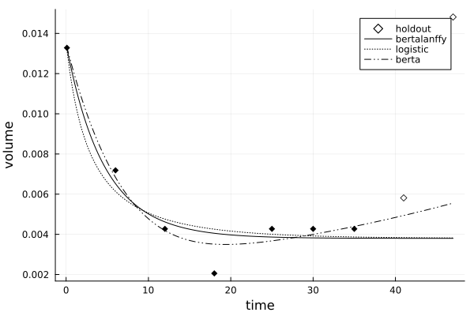

# TumorGrowth.jl

A package providing simple predictive models for tumor growth and tools to apply them to
clinical data.

## Overview

TumorGrowth.jl provides the following ODE models for tumor growth:

| model                           | description                             | parameters, `p`       | analytic? | ODE                                   |
|:--------------------------------|:----------------------------------------|:----------------------|:----------|:--------------------------------------|
| [`bertalanffy`](@ref)           | generalized Bertalanffy (GB)            | `(; v0, v∞, ω, λ)`    | yes       | [`TumorGrowth.bertalanffy_ode`](@ref) |
| [`bertalanffy_numerical`](@ref) | generalized Bertalanffy (testing only)  | `(; v0, v∞, ω, λ)`    | no        | [`TumorGrowth.bertalanffy_ode`](@ref) |
| [`berta`](@ref)                 | 2D extension of generalized Bertalanffy | `(; v0, v∞, ω, λ, γ)` | no        | [`TumorGrowth.berta_ode!`](@ref)      |
| [`gompertz`](@ref)              | Gompertz (GB, `λ=0`)                    | `(; v0, v∞, ω)`       | yes       | [`TumorGrowth.bertalanffy_ode`](@ref) |
| [`logistic`](@ref)              | logistic/Verhulst (GB, `λ=-1`)          | `(; v0, v∞, ω)`       | yes       | [`TumorGrowth.bertalanffy_ode`](@ref) |
| [`classical_bertalanffy`](@ref) | classical Bertalanffy (GB, `λ=1/3`)     | `(; v0, v∞, ω)`       | yes       | [`TumorGrowth.bertalanffy_ode`](@ref) |
| [`neural(rng, network)`](@ref)  | neural ODE with Lux.jl `network`        | `(; v0, v∞, θ)`       | no        | [`TumorGrowth.nerual_ode`](@ref) |

The models themselves predict a sequence of lesion volumes, given times and parameters:

```@example overview
using TumorGrowth

times = times = [0.1, 6.0, 16.0, 24.0, 32.0, 39.0]
p = (v0=0.0002261, v∞=2.792e-5,  ω=0.05731) # `v0` is the intial volume
gompertz(times, p)
```

It furthemore provides a [`CalibrationModel`](@ref) tool to calibrate model parameters,
given a history of measurments, and a [`compare`](@ref) tool to compare models on a
holdout set.


## Quick start

Continuing the example above, we grab some real clinical data from Laleh et
al. [(2022)](https://doi.org/10.1371/journal.pcbi.1009822) "Classical mathematical models
for prediction of response to chemotherapy and immunotherapy", *PLOS Computational
Biology*":

```@example overview
data = patient_data();
record = data[16]   # storing all measurments for one lesion
keys(record)
```

Next, we calibrate the generalized Bertalanffy model using this particular patient record:

```@example overview
times = record.T_weeks
volumes = record.Lesion_normvol  # volumes normalized by max over dataset

problem = CalibrationProblem(times, volumes, bertalanffy)
solve!(problem, 2000)  # apply 2000 iterations of the calibration algorithm
p = solution(problem)
pretty(p)
```

We can visualize the outcome and make predictions for an extended time period:

```julia
using Plots
plot(problem)
```



```@example overview
extended_times = vcat(times, [46.0, 53.1])
bertalanffy(extended_times, p)
```

And compare several models on a holdout set:

```@example overview
comparison = compare(times, volumes, [bertalanffy, logistic, berta], n_holdout=2)
```

```julia
plot(comparison)
```


