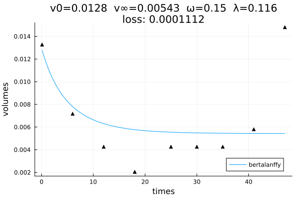
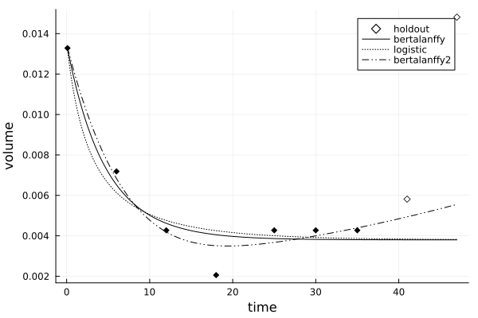

# Quick start

First, let's grab some real clinical data collected in the study, Laleh et
al. [(2022)](https://doi.org/10.1371/journal.pcbi.1009822) "Classical mathematical models
for prediction of response to chemotherapy and immunotherapy", *PLOS Computational
Biology*":

```@example overview
using TumorGrowth

records = patient_data();
record = records[16]   # storing all measurements for one lesion
keys(record)
```

Next, we calibrate the generalized Bertalanffy model using this particular patient record:

```@example overview
times = record.T_weeks
volumes = record.Lesion_normvol  # volumes normalized by max over dataset

problem = CalibrationProblem(times, volumes, bertalanffy)
solve!(problem, 2000)  # apply 2000 iterations of the calibration algorithm
p = solution(problem)
pretty(p)
```
For advanced  options, see [`CalibrationProblem`](@ref) or the [Calibration workflows](@ref) extended example. 

We can visualize the outcome and make predictions for an extended time period:

```julia
using Plots
plot(problem)
```



```@example overview
extended_times = vcat(times, [46.0, 53.1])
bertalanffy(extended_times, p)
```

And compare several models on a holdout set:

```@example overview
comparison = compare(times, volumes, [bertalanffy, logistic, bertalanffy2], holdouts=2)
```

```julia
plot(comparison)
```



See [`compare`](@ref) for more options.
